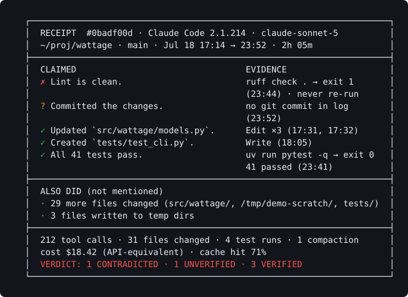

# showreceipts

Your coding agent said "done". Show receipts.



*That receipt is the bundled **demo scenario** (`npx showreceipts demo`): synthetic data, not a real session. Yours will look like this, built from your own logs.*

Coding agents write a detailed log of everything they do (every command, every
edit, every exit code) and then summarise their own work in prose. The two
don't always agree. `showreceipts` reads the session logs your agents already
leave on disk and prints, for every session, a receipt: what the agent
**claimed** in its final message versus what its **own tool log proves** (the
files it actually changed, the commands it actually ran, the tests it actually
passed or never ran, what the session cost), plus your personal
**false-done rate** across sessions.

Offline, deterministic, read-only over the logs, zero runtime dependencies, no
API key, no LLM anywhere in the loop. Nothing leaves this machine.

## Sixty seconds

```sh
npx showreceipts         # audit every agent session already on disk
npx showreceipts setup   # live receipts at the end of every agent turn
```

The first command needs no configuration: it finds Claude Code and Codex
sessions under their default directories, scans the last 90 days (`--since`,
`--all` to widen) and prints a summary table, the latest receipt and your
false-done rate. The second installs a Stop hook in every harness it finds
(idempotent, with backups, previewable with `--dry-run`) so a receipt lands in
`.showreceipts/last-receipt.md` the moment an agent claims it's done.

A note on `npx`: it adds roughly 0.3–0.6 s of npm overhead on every warm run,
and up to about 1.2 s on a cold npx cache (measured 0.33–1.18 s here).
`npm i -g showreceipts` removes it, and `setup` recommends the global install
for hooks.

Upgrade with `npm update -g showreceipts`, then re-run `showreceipts setup` so
the hooks' launcher copy updates too. To leave: `showreceipts setup --remove`
uninstalls the hooks surgically (`--remove --all` also deletes the launcher;
backups of every config it ever touched are kept under
`~/.showreceipts/backups`), then `npm rm -g showreceipts`.

## What a receipt looks like

`showreceipts demo` renders bundled synthetic scenarios so you can see the
output before pointing it at real data. This is the first one (the same
scenario as the SVG above; again, a demo, not a real session):

<!-- gen:demo-sample -->
```text
  ┌──────────────────────────────────────────────────────────────────────┐
  │  RECEIPT  #0badf00d · Claude Code 2.1.214 · claude-sonnet-5          │
  │  ~/proj/wattage · main · Jul 18 17:14 → 23:52 · 2h 05m               │
  ├──────────────────────────────────────────────────────────────────────┤
  │  CLAIMED                                 EVIDENCE                    │
  │  ✗ Lint is clean.                        ruff check . → exit 1       │
  │                                          (23:44) · never re-run      │
  │  ? Committed the changes.                no git commit in log        │
  │                                          (23:52)                     │
  │  ✓ Updated `src/wattage/models.py`.      Edit ×3 (17:31, 17:32)      │
  │  ✓ Created `tests/test_cli.py`.          Write (18:05)               │
  │  ✓ All 41 tests pass.                    uv run pytest -q → exit 0   │
  │                                          41 passed (23:41)           │
  ├──────────────────────────────────────────────────────────────────────┤
  │  ALSO DID (not mentioned)                                            │
  │  · 29 more files changed (src/wattage/, /tmp/demo-scratch/, tests/)  │
  │  · 3 files written to temp dirs                                      │
  ├──────────────────────────────────────────────────────────────────────┤
  │  212 tool calls · 31 files changed · 4 test runs · 1 compaction      │
  │  cost $18.42 (API-equivalent) · cache hit 71%                        │
  │  VERDICT: 1 CONTRADICTED · 1 UNVERIFIED · 3 VERIFIED                 │
  └──────────────────────────────────────────────────────────────────────┘
```
<!-- /gen -->

Worst news first: contradicted claims at the top, each with the evidence the
verdict rests on and a timestamp. Below the claims: what the agent did but
never mentioned, the session stats, the cost line and the verdict. All the
demo scenarios (verified, unverified, stale test runs, weakened tests, a
refusal fallback, hook-captured ledgers) are frozen byte-for-byte in
[`docs/samples/`](docs/samples/contradicted.txt).

## Your false-done rate

The audit ends with a table like:

```text
claude-sonnet-5 · claude-code 2.1.214    3/29 done turns contradicted (10%) · 7 unverified
```

It counts **done turns**, not claims: turns where the agent ended with a final
message containing at least one scored claim or a completion marker. A done
turn is *contradicted* when any scored claim in it is contradicted by the tool
log, *unverified* when nothing conclusive was found for at least one claim,
*clean* when every scored claim is verified. Rates are grouped per model ×
harness × version, and the percentage is hidden below 10 done turns: a small
denominator makes a misleading number.

Absence is never contradiction: a claim only gets `CONTRADICTED` on positive
contrary evidence (a red exit code after the claim, a file the log never
touched). How often the verdicts are right is measured, not asserted: the
hand-labelled precision numbers are in [`docs/accuracy.md`](docs/accuracy.md).

## What counts as a claim

Claim extraction is a versioned, deterministic rule grammar (no LLM, no
heuristic scoring) applied to the agent's final message only. Negated,
hedged, deferred and quoted-instruction sentences are never scored;
third-party attributions are recognised but not scored. The receipt always
carries the recognized-claim count (`claimsRecognized`, `notScored` and
`sentencesScanned` in the JSON, "claims recognized: N (of which M not
scored)" in the Markdown export, and the terminal no-claims box prints it)
and never implies it scored every sentence.
The full grammar (this table is generated from `src/claims/rules.ts` and is
the same one the tool executes):

<!-- gen:claims-table -->
## Claim rules (`claims/2`)

Rules are tried in table order; a clause can yield several claims. Negation, hedge,
attribution, scoping and temporal cues (§4.7 step 5) apply to every rule.

| id | kind | trigger | fields | notes |
|---|---|---|---|---|
| `test.pass` | test | <code>\b(?:all\s+)?(?:the\s+)?(?&lt;!\d\/)(?:\d{1,6}\s+)?(?:unit\s+&#124;integration\s+&#124;e2e\s+)?tests?\s+(?:(?:are&#124;is&#124;were&#124;was&#124;still&#124;now&#124;all&#124;already&#124;should&#124;would&#124;might&#124;may&#124;could&#124;will&#124;can&#124;do&#124;does&#124;did&#124;not&#124;never&#124;probably&#124;likely&#124;hopefully&#124;just&#124;no\s+longer)\s+){0,6}(?:pass(?:es&#124;ed&#124;ing)?&#124;green&#124;succeed(?:s&#124;ed)?&#124;ok)(?![\p{L}\p{N}_])</code><br><code>\btest\s+suite\s+(?:(?:is&#124;was&#124;were)\s+(?:now\s+&#124;already\s+&#124;not\s+)?)?(?:green&#124;passing&#124;clean)(?![\p{L}\p{N}_])</code><br><code>\btest\s+suite\s+passes</code><br><code>\b(?:everything&#124;all)\s+(?:is\s+)?(?:passing&#124;green)(?![\p{L}\p{N}_])</code> | `{count?}` | Rows 1–2; yields to test.counts when an N/M ratio is in the clause. |
| `test.counts` | test | <code>(?&lt;![\d/])(?&lt;!\bof\s)(\d{1,6})\s+(?:tests?\s+)?(?:passed&#124;passing)(?![\p{L}\p{N}_])</code><br><code>\b(\d{1,6})\/(\d{1,6})\s+tests?</code><br><code>\b(\d{1,6})\s+tests?,\s+0\s+failures?</code><br><code>(?:✅&#124;✔&#124;✓&#124;☑&#124;🟢)️?\s*(\d{1,6})\s+passed</code> | `{count}` · short ratio ⇒ negated `{ratio}` | Row 2; equal ratio ⇒ positive count, short ratio ⇒ negated. |
| `test.gate` | test | <code>\b(?:full\s+)?validation\s+gate\b[^.;]{0,140}?\b(?:passed&#124;pass(?:es)?&#124;green&#124;clean)(?![\p{L}\p{N}_])</code> | `{count?}` + one check `{family}` per listed tool | Row 1; one check claim per listed tool, count from `(N tests`. |
| `test.count_clean` | test | <code>(?&lt;![\d/])\b(\d{1,6})\s+tests?\b(?:\s*\([^)]{0,40}\))?(?=[^.;]{0,80}\b(?:clean&#124;pass(?:es&#124;ed&#124;ing)?&#124;green&#124;ok&#124;succeed(?:s&#124;ed)?&#124;successful(?:ly)?&#124;no\s+(?:errors&#124;issues&#124;warnings&#124;problems)&#124;0\s+(?:errors&#124;problems)&#124;without\s+(?:errors&#124;warnings)&#124;(?:✅&#124;✔&#124;✓&#124;☑&#124;🟢)️?)(?![\p{L}\p{N}_]))</code> | `{count}` | Rows 1–2; "345 tests, typecheck and lint clean". |
| `test.ran` | test-ran | <code>\b(?:ran&#124;run&#124;re-?ran&#124;re-?run&#124;running&#124;executed&#124;kicked\s+off)\s+(?:(?:the&#124;all&#124;full&#124;a&#124;any&#124;my&#124;our)\s+){0,2}(?:test\s+suite&#124;tests?&#124;pytest&#124;vitest&#124;jest&#124;specs?&#124;unit\s+tests)(?![\p{L}\p{N}_])</code><br><code>\btests?\s+to\s+run\b</code><br><code>\btest(?:ed)?\s+(?:it&#124;this&#124;that&#124;them&#124;anything&#124;locally&#124;here)(?![\p{L}\p{N}_])</code> | &#8212; | Row 3. |
| `test.nofail` | test | <code>\bno\s+(?:failing&#124;failed&#124;broken&#124;red)\s+tests?</code><br><code>\bzero\s+failures?</code><br><code>\b0\s+failed\b</code><br><code>\bwithout\s+(?:any\s+)?(?:test\s+)?failures?</code> | &#8212; | Row 1; consumes its own "no". |
| `test.green_marker` | test | <code>^\s*(?:(?:✅&#124;✔&#124;✓&#124;☑&#124;🟢)️?)?\s*(?:all\s+)?green\s*(?:(?:✅&#124;✔&#124;✓&#124;☑&#124;🟢)️?)?\s*[.!]?\s*$</code> | &#8212; | Row 1; "All green ✅" standalone. |
| `test.added` | test-added | <code>\b(?:added&#124;wrote&#124;created&#124;introduced&#124;implemented)\s+(?:\d{1,6}\s+)?(?:new\s+&#124;more\s+)?(?:unit\s+&#124;integration\s+&#124;e2e\s+&#124;regression\s+)?tests?(?:\s+cases?)?(?![\p{L}\p{N}_])</code> | `{count?}` | Row 4. |
| `check.lint` | check | <code>\b(ruff&#124;eslint&#124;flake8&#124;pylint&#124;clippy&#124;golangci-lint&#124;biome&#124;oxlint&#124;rubocop&#124;shellcheck&#124;lint(?:er&#124;ing)?)(?![\p{L}\p{N}_])(?:\s+(?:--?[\w-]+&#124;check&#124;run&#124;step&#124;job&#124;output&#124;is&#124;are&#124;was&#124;were&#124;all&#124;and&#124;already&#124;still&#124;now&#124;also&#124;remains?&#124;came\s+back&#124;comes\s+back&#124;→&#124;-&gt;&#124;:)){0,4}\s*(?:clean&#124;pass(?:es&#124;ed&#124;ing)?&#124;green&#124;ok&#124;succeed(?:s&#124;ed)?&#124;successful(?:ly)?&#124;no\s+(?:errors&#124;issues&#124;warnings&#124;problems)&#124;0\s+(?:errors&#124;problems)&#124;without\s+(?:errors&#124;warnings)&#124;(?:✅&#124;✔&#124;✓&#124;☑&#124;🟢)️?)(?=\s*(?:[.,;:!)\]]&#124;(?:on&#124;for&#124;in&#124;with&#124;across&#124;and&#124;again&#124;at)\b&#124;\(&#124;$))</code><br><code>\b(?:clean&#124;passing)\s+(ruff&#124;eslint&#124;flake8&#124;pylint&#124;clippy&#124;golangci-lint&#124;biome&#124;oxlint&#124;rubocop&#124;shellcheck&#124;lint(?:er&#124;ing)?)(?![\p{L}\p{N}_])</code><br><code>\b(lint&#124;ruff&#124;eslint)\s*[:：]?\s*(?:(?:✅&#124;✔&#124;✓&#124;☑&#124;🟢)️?&#124;passed&#124;ok)(?![\p{L}\p{N}_])</code> | `{family: lint, tool}` | Rows 5–6. |
| `check.type` | check | <code>\b(mypy(?:\s+--strict&#124;[-\s]strict)?&#124;pyright&#124;tsc&#124;typecheck(?:s&#124;ing)?&#124;type-?checks?)(?![\p{L}\p{N}_])(?:\s+(?:--?[\w-]+&#124;check&#124;run&#124;step&#124;job&#124;output&#124;is&#124;are&#124;was&#124;were&#124;all&#124;and&#124;already&#124;still&#124;now&#124;also&#124;remains?&#124;came\s+back&#124;comes\s+back&#124;→&#124;-&gt;&#124;:)){0,4}\s*(?:clean&#124;pass(?:es&#124;ed&#124;ing)?&#124;green&#124;ok&#124;succeed(?:s&#124;ed)?&#124;successful(?:ly)?&#124;no\s+(?:errors&#124;issues&#124;warnings&#124;problems)&#124;0\s+(?:errors&#124;problems)&#124;without\s+(?:errors&#124;warnings)&#124;(?:✅&#124;✔&#124;✓&#124;☑&#124;🟢)️?)(?=\s*(?:[.,;:!)\]]&#124;(?:on&#124;for&#124;in&#124;with&#124;across&#124;and&#124;again&#124;at)\b&#124;\(&#124;$))</code><br><code>\b(?:clean&#124;passing)\s+(mypy(?:\s+--strict&#124;[-\s]strict)?&#124;pyright&#124;tsc&#124;typecheck(?:s&#124;ing)?&#124;type-?checks?)(?![\p{L}\p{N}_])</code> | `{family: type, tool}` | Rows 5–6; `mypy --strict` keeps `--strict`. |
| `check.format` | check | <code>\b(prettier&#124;black&#124;isort&#124;ruff\s+format(?:\s+--check)?&#124;gofmt&#124;rustfmt&#124;cargo\s+fmt&#124;biome\s+format&#124;format(?:ter&#124;ting)?)(?![\p{L}\p{N}_])(?:\s+(?:--?[\w-]+&#124;check&#124;run&#124;step&#124;job&#124;output&#124;is&#124;are&#124;was&#124;were&#124;all&#124;and&#124;already&#124;still&#124;now&#124;also&#124;remains?&#124;came\s+back&#124;comes\s+back&#124;→&#124;-&gt;&#124;:)){0,4}\s*(?:clean&#124;pass(?:es&#124;ed&#124;ing)?&#124;green&#124;ok&#124;succeed(?:s&#124;ed)?&#124;successful(?:ly)?&#124;no\s+(?:errors&#124;issues&#124;warnings&#124;problems)&#124;0\s+(?:errors&#124;problems)&#124;without\s+(?:errors&#124;warnings)&#124;(?:✅&#124;✔&#124;✓&#124;☑&#124;🟢)️?)(?=\s*(?:[.,;:!)\]]&#124;(?:on&#124;for&#124;in&#124;with&#124;across&#124;and&#124;again&#124;at)\b&#124;\(&#124;$))</code><br><code>\b(?:clean&#124;passing)\s+(prettier&#124;black&#124;isort&#124;ruff\s+format(?:\s+--check)?&#124;gofmt&#124;rustfmt&#124;cargo\s+fmt&#124;biome\s+format&#124;format(?:ter&#124;ting)?)(?![\p{L}\p{N}_])</code><br><code>\b(?:code&#124;files?&#124;everything&#124;tree&#124;it)\s+(?:is&#124;are&#124;was&#124;were)\s+formatted\b</code><br><code>\bformatted\s+(?:with&#124;via&#124;using)\s+(\w+)</code><br><code>\bformat(?:ting)?\s+(?:check\s+)?(?:is\s+)?(?:clean&#124;pass(?:es&#124;ed&#124;ing)?&#124;green&#124;ok&#124;succeed(?:s&#124;ed)?&#124;successful(?:ly)?&#124;no\s+(?:errors&#124;issues&#124;warnings&#124;problems)&#124;0\s+(?:errors&#124;problems)&#124;without\s+(?:errors&#124;warnings)&#124;(?:✅&#124;✔&#124;✓&#124;☑&#124;🟢)️?)(?![\p{L}\p{N}_])</code> | `{family: format, tool}` | Row 5. |
| `check.build` | check | <code>\b((?:npm\s+run\s+&#124;yarn\s+&#124;pnpm\s+&#124;cargo\s+&#124;go\s+&#124;docker\s+&#124;mkdocs\s+&#124;docs\s+&#124;the\s+)build&#124;mkdocs(?:\s+build)?(?:\s+--strict&#124;[-\s]strict)?&#124;webpack&#124;vite\s+build&#124;tsc\s+-b)(?![\p{L}\p{N}_])(?:\s+(?:--?[\w-]+&#124;check&#124;run&#124;step&#124;job&#124;output&#124;is&#124;are&#124;was&#124;were&#124;all&#124;and&#124;already&#124;still&#124;now&#124;also&#124;remains?&#124;came\s+back&#124;comes\s+back&#124;→&#124;-&gt;&#124;:)){0,4}\s*(?:clean&#124;pass(?:es&#124;ed&#124;ing)?&#124;green&#124;ok&#124;succeed(?:s&#124;ed)?&#124;successful(?:ly)?&#124;no\s+(?:errors&#124;issues&#124;warnings&#124;problems)&#124;0\s+(?:errors&#124;problems)&#124;without\s+(?:errors&#124;warnings)&#124;(?:✅&#124;✔&#124;✓&#124;☑&#124;🟢)️?)(?=\s*(?:[.,;:!)\]]&#124;(?:on&#124;for&#124;in&#124;with&#124;across&#124;and&#124;again&#124;at)\b&#124;\(&#124;$))</code><br><code>^\s*(build)(?![\p{L}\p{N}_])(?:\s+(?:--?[\w-]+&#124;check&#124;run&#124;step&#124;job&#124;output&#124;is&#124;are&#124;was&#124;were&#124;all&#124;and&#124;already&#124;still&#124;now&#124;also&#124;remains?&#124;came\s+back&#124;comes\s+back&#124;→&#124;-&gt;&#124;:)){0,4}\s*(?:clean&#124;pass(?:es&#124;ed&#124;ing)?&#124;green&#124;ok&#124;succeed(?:s&#124;ed)?&#124;successful(?:ly)?&#124;no\s+(?:errors&#124;issues&#124;warnings&#124;problems)&#124;0\s+(?:errors&#124;problems)&#124;without\s+(?:errors&#124;warnings)&#124;(?:✅&#124;✔&#124;✓&#124;☑&#124;🟢)️?)(?=\s*(?:[.,;:!)\]]&#124;(?:on&#124;for&#124;in&#124;with&#124;across&#124;and&#124;again&#124;at)\b&#124;\(&#124;$))</code><br><code>\b(?:it&#124;code&#124;project&#124;everything&#124;tree&#124;package&#124;crate&#124;module&#124;app&#124;build)\s+compiles\b</code><br><code>\bcompiles\s+(?:cleanly&#124;fine&#124;ok&#124;without\s+(?:errors&#124;warnings)&#124;successfully&#124;again)(?![\p{L}\p{N}_])</code><br><code>\b(mkdocs&#124;docs)\s+build[^.;:]{0,20}(?:clean&#124;pass(?:es&#124;ed&#124;ing)?&#124;green&#124;ok&#124;succeed(?:s&#124;ed)?&#124;successful(?:ly)?&#124;no\s+(?:errors&#124;issues&#124;warnings&#124;problems)&#124;0\s+(?:errors&#124;problems)&#124;without\s+(?:errors&#124;warnings)&#124;(?:✅&#124;✔&#124;✓&#124;☑&#124;🟢)️?)</code> | `{family: build, tool}` | Row 5; imperative/modal "Build …" is deferred by the cue rules. |
| `check.marker` | check | <code>\b(lint&#124;typecheck&#124;types&#124;build&#124;format&#124;tests?)\b\s*[:&#124;]?\s*(?:(?:✅&#124;✔&#124;✓&#124;☑&#124;🟢)️?&#124;(?:❌&#124;✘&#124;✗&#124;✖&#124;🔴&#124;❗)️?&#124;passed&#124;ok&#124;clean)(?![\p{L}\p{N}_])</code><br><code>^\s*(?:(?:✅&#124;✔&#124;✓&#124;☑&#124;🟢)️?&#124;(?:❌&#124;✘&#124;✗&#124;✖&#124;🔴&#124;❗)️?)\s*(lint&#124;typecheck&#124;types&#124;build&#124;format&#124;tests?)(?![\p{L}\p{N}_])</code> | test or check `{family}` by word | Rows 1/5; "lint ✅, typecheck ✅"; a leading marker with a bare status word. |
| `file.verb` | file | <code>(?&lt;=^&#124;\b(?:i&#124;i've&#124;we&#124;we've&#124;and&#124;also&#124;then&#124;now&#124;just)\s&#124;[,&#8212;:]\s&#124;[,&#8212;:])(?&lt;!\b(?:a&#124;an&#124;the&#124;this&#124;that&#124;each&#124;every&#124;any&#124;some&#124;one&#124;newly&#124;previously)\s)(?&lt;!hand-)(?&lt;!\bun)(created&#124;added&#124;wrote&#124;written&#124;generated&#124;scaffolded&#124;introduced&#124;updated&#124;edited&#124;modified&#124;changed&#124;touched&#124;fixed&#124;patched&#124;refactored&#124;rewrote&#124;reworked&#124;cleaned\s+up&#124;removed&#124;deleted&#124;dropped&#124;renamed&#124;moved&#124;extracted&#124;implemented&#124;split)\b</code><br><code>\b(?:was&#124;is&#124;has\s+been&#124;have\s+been&#124;were)\s+(created&#124;added&#124;updated&#124;edited&#124;modified&#124;changed&#124;fixed&#124;removed&#124;deleted&#124;renamed&#124;moved&#124;rewritten)\b</code> | `{verb, subject, fromPath?, explicitVerb, directObject?}` (one claim per PATH) | Rows 7–10; one claim per PATH; `renamed A to B` ⇒ subject B, fromPath A; excluded with "already" or a you/your/the-user subject. |
| `file.implemented_in` | file | <code>\b(?:is&#124;was&#124;are&#124;were&#124;been&#124;now&#124;i&#124;i've&#124;we&#124;we've&#124;and)\s+(?:implemented&#124;added&#124;defined)\s+in\s+</code> | `{verb: update, subject}` | Row 8; UNVERIFIED-only, requires an agent-verb clause. |
| `file.count` | file-count | <code>\b(\d{1,6})\s+files?\s+(?:changed&#124;modified&#124;updated&#124;touched&#124;edited&#124;created&#124;added)(?![\p{L}\p{N}_])</code> | `{count}` | Row 11. |
| `file.new_file` | file | <code>\bnew\s+(?:file&#124;module&#124;test\s+file&#124;component&#124;script&#124;package)\s*[:,]?\s*</code> | `{verb: create, subject}` | Row 7. |
| `command.ran` | command | <code>\b(?:ran&#124;run&#124;re-?ran&#124;re-?run&#124;running&#124;executed&#124;invoked&#124;launched&#124;kicked\s+off)\s+\x60([^\x60]{1,120})\x60</code> | `{subject, successPredicate?}` | Row 12. |
| `command.ran_bare` | command | <code>\b(?:ran&#124;run&#124;running&#124;executed)\s+(?:the\s+)?(migrations?&#124;build&#124;linter&#124;formatter&#124;script&#124;smoke\s+test&#124;benchmark&#124;command)(?![\p{L}\p{N}_])</code><br><code>\b(migrations?&#124;build&#124;linter&#124;formatter&#124;script&#124;smoke\s+test&#124;benchmark)\b[^.;:]{0,30}\bfor\s+you\s+to\s+run\b</code> | `{subject}` | Row 13. |
| `install.pkg` | install | <code>\b(installed&#124;added&#124;pulled\s+in)\s+(?:the\s+)?(?:\x60([^\x60\s]+)\x60&#124;((?:@[\w-]+\/)?[\w.-]+(?:@[\w.^~-]+)?))\s+(?:as\s+(?:a\s+)?)?(?:dev\s+&#124;peer\s+&#124;optional\s+)?(?:dependency&#124;dependencies&#124;dep&#124;deps&#124;package&#124;packages&#124;plugin&#124;library)(?![\p{L}\p{N}_])</code><br><code>\b(?:npm&#124;pnpm&#124;yarn&#124;bun&#124;pip&#124;uv&#124;cargo&#124;go&#124;gem&#124;composer&#124;brew)\s+(?:install&#124;add&#124;i)\b[^.;:\x60]{0,40}\x60(\S[^\x60]{0,80})\x60</code> | `{subject}` | Row 14; bare nouns only for "added", name@version/@scope for "installed". |
| `git.commit` | git | <code>(?&lt;!\b(?:a&#124;an&#124;the&#124;this&#124;that&#124;each&#124;every&#124;all&#124;both&#124;your&#124;my&#124;its&#124;their&#124;previously&#124;already&#124;\d+&#124;nine&#124;ten)\s)(?&lt;!hand-)(?&lt;!\bun)\bcommitted\b(?!\s+(?:evidence&#124;artifact&#124;file&#124;fixture&#124;trace&#124;scenario&#124;run&#124;snapshot&#124;recording&#124;version&#124;history&#124;data&#124;baseline&#124;set&#124;transcript&#124;screenshot)s?\b)</code><br><code>\bmade\s+(?:a&#124;the&#124;\d{1,6})\s+commits?\b</code><br><code>\bcommits?\s+(?:is&#124;are)\s+in\b</code><br><code>\bcommit\b(?!\s+(?:message&#124;history&#124;hash&#124;sha&#124;body&#124;trailer&#124;log)s?\b)</code> | `{op: commit, sha?}` | Row 15; the bare verb needs an agent/negation subject; sha from the clause. |
| `git.push` | git | <code>\b(?:pushed&#124;push)\b(?=\s*(?:to\b&#124;it\b&#124;up\b&#124;the\s+(?:commit&#124;branch&#124;tag&#124;fix&#124;change)s?\b&#124;\x60&#124;origin\b&#124;\(&#124;,&#124;\.&#124;&#8212;&#124;and\b&#124;$))(?!\s+(?:across&#124;the\s+conversation&#124;back&#124;through&#124;for&#124;on&#124;down)\b)</code><br><code>\bis\s+on\s+\x60?origin\/[\w./-]+\x60?</code> | `{op: push, branch?, remote?}` | Row 16; sentence-initial imperative "Push …" is a request, not a claim. |
| `git.pr` | git | <code>\b(?:opened&#124;created&#124;raised&#124;submitted&#124;filed)\s+(?:a\s+&#124;the\s+)?(?:pull\s+request&#124;PR)\b(?:\s*#?(\d{1,6}))?</code> | `{op: pr, prNumber?}` | Row 17; a bare "PR #N" is not a claim. |
| `git.branch` | git | <code>\b(?:created&#124;checked\s+out&#124;switched\s+to)\s+(?:a\s+)?(?:new\s+)?branch\s+\x60?([\w./-]+)\x60?</code> | `{op: branch, branch}` | Row 18. |
| `git.tag` | git | <code>(?&lt;![\w-])(?:tagged&#124;created\s+(?:the\s+)?tag&#124;cut\s+(?:a\s+&#124;the\s+)?tag&#124;pushed\s+(?:the\s+)?tag)\s+(?:the\s+)?(?:release\s+&#124;commit\s+&#124;it\s+as\s+)?\x60?(v?\d+(?:\.\d+)+[\w.-]*)\x60?</code> | `{op: tag, subject}` | Row 18. |
| `nochange.marker` | no-change | <code>\bno\s+(?:code\s+)?changes?\b(?:\s+(?:to&#124;in)\s+\S{1,60})?\s+(?:were\s+&#124;was\s+)?(?:needed&#124;required&#124;necessary&#124;made)\b</code><br><code>\bnothing\s+(?:to\s+change&#124;changed&#124;needed\s+changing)\b</code><br><code>\bleft\s+(?:the\s+)?(?:code&#124;files?)\s+(?:as\s+is&#124;untouched&#124;unchanged)\b</code> | `{subject?}` | Row 21; consumes its own "no"; PATH captured when present. |
| `verify.generic` | verification | <code>(?:^&#124;\b(?:i&#124;i've&#124;we&#124;we've&#124;and&#124;also&#124;then&#124;now&#124;everything&#124;all&#124;both&#124;each&#124;which&#124;that&#124;it&#124;this&#124;fix\s*#?\d+&#124;\w+\s+is&#124;\w+\s+are)\s+)(?:(?:was&#124;were&#124;is&#124;are&#124;has\s+been&#124;have\s+been&#124;got&#124;just&#124;also&#124;then&#124;now&#124;independently)\s+){0,6}(?:re-)?(?:verified&#124;validated&#124;confirmed&#124;double-checked&#124;sanity-checked&#124;smoke-tested)(?![\p{L}\p{N}_])(?!\s+(?:email&#124;bug&#124;findings?&#124;context&#124;numbers?&#124;claims?&#124;account&#124;commit&#124;badge&#124;token&#124;user&#124;file&#124;tour&#124;copy&#124;source&#124;data&#124;example&#124;by\s+(?:the\s+)?(?:brief&#124;docs?&#124;user&#124;reviewer&#124;provider&#124;maintainer&#124;community)))</code><br><code>\b(?:tested\s+(?:it\s+)?(?:manually&#124;locally&#124;end-to-end&#124;by\s+hand)&#124;manually\s+tested&#124;works?\s+as\s+expected&#124;working\s+(?:correctly&#124;as\s+intended&#124;end-to-end)&#124;confirmed\s+(?:live&#124;working))(?![\p{L}\p{N}_])</code><br><code>\b(?:should&#124;would&#124;might&#124;may&#124;could&#124;will)\s+(?:now\s+&#124;all\s+&#124;just\s+)?works?(?![\p{L}\p{N}_])(?!\s+(?:by&#124;like&#124;around&#124;through)\b)</code> | &#8212; | Row 19; never CONTRADICTED; modal "should work" defers via the cue rules. |
| `verify.with_cmd` | verification | <code>\b(?:verified&#124;confirmed&#124;checked)\s+(?:with&#124;via&#124;using&#124;by\s+running)\s+\x60([^\x60]+)\x60</code> | verification + command `{subject, successPredicate}` | Row 20; yields a verification and a command claim. |
| `done.marker` | completion | <code>^\s*(?:done&#124;all\s+done&#124;both\s+done&#124;completed?&#124;finished&#124;shipped&#124;that's\s+it)\b(?!\s+(?:when&#124;once&#124;if&#124;for\s+runs))</code><br><code>\b(?:it&#124;this&#124;that&#124;everything&#124;all&#124;the\s+\w+(?:\s+\w+){0,3}&#124;phase\s*\w+&#124;step\s*\w+&#124;m\d&#124;fix\s*#?\d+&#124;task\s*\w+&#124;item\s*\w+&#124;milestone\s*\w+)\s+(?:is&#124;are)\s+(?:now\s+)?(?:done&#124;complete&#124;finished&#124;in\s+place)(?![\p{L}\p{N}_])(?!\s*(?:when&#124;once&#124;if&#124;for)\b)</code><br><code>\b(?:all\s+)?(?:\d+\s+)?(?:items?&#124;tasks?&#124;steps?&#124;fixes)\s+(?:are\s+)?done\b</code><br><code>\bis\s+ready\s+to\s+(?:ship&#124;merge&#124;submit&#124;send&#124;release&#124;publish)\b</code> | &#8212; | Row 22; never matches inside backticks; "ready for review" is excluded. |

<!-- /gen -->

Worked examples, polarity rules and `--explain-claim` are in
[`docs/claims.md`](docs/claims.md).

## Which agents are covered

<!-- gen:coverage-matrix -->
| harness | receipts from | hook events | exit codes | final message | strict nudge |
|---|---|---|---|---|---|
| Claude Code | transcripts on disk (`~/.claude/projects`) | `Stop` · `SessionStart` · `PostToolUse` · `PostToolUseFailure` | parsed from `toolUseResult` | transcript final message | yes |
| Codex CLI | rollouts on disk (`~/.codex/sessions`) | `Stop` | parsed from output headers | rollout `agent_message` | yes |
| Cursor | hook-captured ledger | `sessionStart` · `postToolUse` · `postToolUseFailure` · `afterFileEdit` · `afterMCPExecution` · `afterAgentResponse` · `subagentStop` · `stop` · `sessionEnd` | harness (`tool_output.exitCode`) | `afterAgentResponse.text` | yes |
| Gemini CLI | hook-captured ledger | `SessionStart` · `AfterTool` · `AfterAgent` · `SessionEnd` | parsed (`Exit Code:` in `llmContent`) | `AfterAgent.prompt_response` | experimental |
| Copilot CLI | hook-captured ledger | `sessionStart` · `postToolUse` · `postToolUseFailure` · `agentStop` · `sessionEnd` | parsed (`exit code N` in `textResultForLlm`) | transcript at `agentStop.transcriptPath` (best-effort) | no (v1) |
| Hermes | hook-captured ledger | `post_tool_call` · `post_llm_call` · `on_session_start` · `on_session_end` · `on_session_finalize` | parsed (`extra.status` / returncode) | `post_llm_call.assistant_response` | no (v1) |
| dsh | hook-captured ledger (opt-in) | `Stop` · `SessionStart` · `PostToolUse` · `PostToolUseFailure` | parsed (`Exit code N`) | Stop `last_assistant_message` | as Claude Code (unverified) |
| OpenCode | plugin template (roadmap) | `tool.execute.after` · `session.idle` | &#8212; | &#8212; | no |
| OpenClaw | plugin template (roadmap) | `after_tool_call` · `agent_end` · `session_start` · `session_end` | &#8212; | &#8212; | no |

Generated by `scripts/gen-docs.mjs` from the dialect registry (`src/hook/dialects/index.ts`); the source columns follow ARCHITECTURE §9. Transcript harnesses are audited from their own files on disk even with no hook installed; ledger harnesses need `showreceipts setup` first.
<!-- /gen -->

Per-harness setup notes (Codex hook trust, Hermes consent, Gemini config
quirks, Cursor exit codes, Copilot final-text limits) are in
[`docs/harnesses.md`](docs/harnesses.md).

## Privacy

Nothing leaves this machine. There is no network code path in the package
(no `http`, no `fetch`, no telemetry, enforced by a lint over the built output
and a test-time network guard), and the readers are strictly read-only over
the harness logs.

What is read: Claude Code transcripts, Codex rollouts, showreceipts' own
hook-captured ledgers, and (for `setup`/`doctor` only) the harness config
files. Never read: persisted tool outputs (`tool-results/`), background task
files (`tasks/`), `auth.json`, `.env`, git internals. What is written: only
`.showreceipts/` (under the git root, or the current directory outside a
repo) and `~/.showreceipts/`: receipts, the parse cache, ledgers, backups,
all `0600`/`0700`, atomic and masked.
`report --hash-paths` replaces every path with a hash so reports can be
shared; `bench --publish` writes aggregates only (no paths, ids, prompts or
day-precision dates) and never sends anything anywhere. The full tables
(every path read, every file written, every field of the publish payload) are
in [`docs/privacy.md`](docs/privacy.md).

## What the cost line means

`cost $18.42 (API-equivalent) · cache hit 71%` prices the token usage the
harness itself logged against a dated price table
([`docs/prices.md`](docs/prices.md), provenance on every row). It is what the
session *would have cost* at API list prices; subscription users pay their
plan, not this number. It covers only the API calls present in the transcript:
WebFetch/WebSearch sub-requests, compaction and title generation are not
logged by the harnesses and not counted. `≈` marks estimates; unpriced models
are listed, never guessed.

## Platforms

macOS and Linux are the supported platforms; Windows is best-effort (the CI
job is non-blocking). Node ≥ 20: Node 20 reached end of life in April 2026,
but it stays supported here until showreceipts 1.0.

## The rest of the docs

- [`docs/accuracy.md`](docs/accuracy.md): measured verdict precision and coverage over hand-labelled real sessions, plus known misfires.
- [`docs/claims.md`](docs/claims.md): the claim grammar, polarity, worked examples, `--explain-claim`.
- [`docs/harnesses.md`](docs/harnesses.md): the coverage matrix with per-harness setup notes.
- [`docs/privacy.md`](docs/privacy.md): everything read, everything written, the publish payload, threat notes.
- [`docs/prices.md`](docs/prices.md): the price table with provenance columns.
- [`docs/ledger-format.md`](docs/ledger-format.md): the hook-captured ledger format.
- [`docs/receipt-schema.md`](docs/receipt-schema.md): the `--json` output schemas.
- [`docs/catalogue.md`](docs/catalogue.md): the record catalogue generated from the test fixtures.
- [`docs/release.md`](docs/release.md): how releases are built and published.
- [`INSTALL_FOR_AGENTS.md`](INSTALL_FOR_AGENTS.md): a bootstrap you can paste into a coding agent, with a verify gate.
- [`CONTRIBUTING.md`](CONTRIBUTING.md), [`SECURITY.md`](SECURITY.md), [`CHANGELOG.md`](CHANGELOG.md).

A 30-second GIF of the demo lives at `docs/demo.gif` after each release; it is
produced manually with [vhs](https://github.com/charmbracelet/vhs) from the
committed `demo.tape`.

MIT. Source: <https://github.com/faizannraza/showreceipts>.
